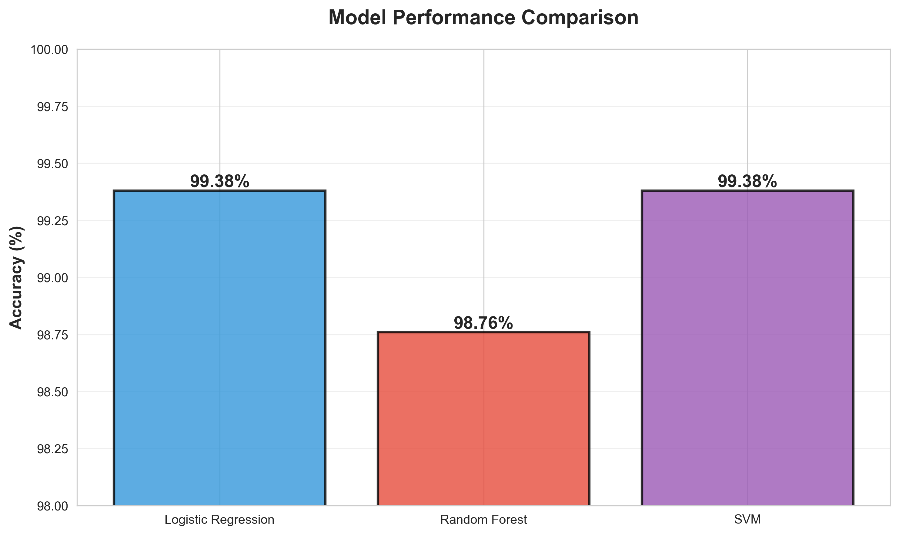
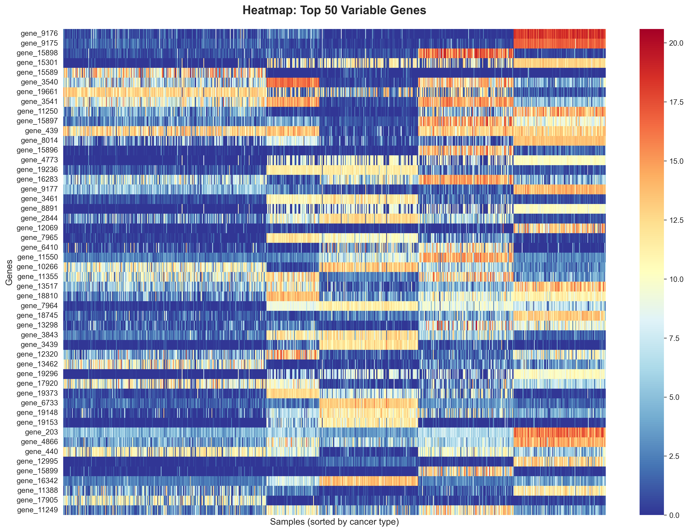
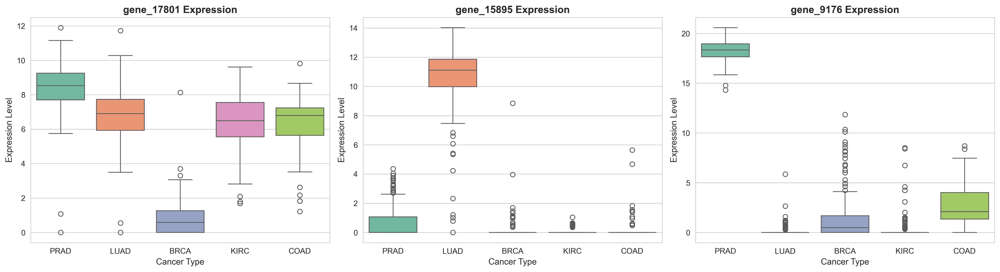

# 🧬 Cancer Gene Expression Classification 🧬

A machine learning project that classifies 5 different cancer types based on gene expression data with **99.38% accuracy**.

[](https://www.python.org/)
[](https://scikit-learn.org/)
[](https://jupyter.org/)

---

## Table of Contents
- [Project Overview](#project-overview)
- [Dataset](#dataset)
- [Methodology](#methodology)
- [Results](#results)
- [Key Findings](#key-findings)
- [Technologies Used](#technologies-used)
- [Installation & Usage](#installation--usage)
- [Future Improvements](#future-improvements)

---

## Project Overview

This project demonstrates the application of machine learning to bioinformatics by building classification models that distinguish between 5 different cancer types using RNA-seq gene expression data:

- **BRCA** - Breast Invasive Carcinoma
- **KIRC** - Kidney Renal Clear Cell Carcinoma
- **LUAD** - Lung Adenocarcinoma
- **PRAD** - Prostate Adenocarcinoma
- **COAD** - Colon Adenocarcinoma

The goal is to identify cancer types based on their unique gene expression signatures, which has real-world applications in cancer diagnosis and personalized medicine.

---

## Dataset

- **Source**: TCGA (The Cancer Genome Atlas) via Kaggle
- **Samples**: 801 tumor samples
- **Features**: 20,531 genes measured via RNA-seq
- **Classes**: 5 cancer types
- **Data Split**: 80% training (640 samples) / 20% testing (161 samples)

**Note**: Due to file size constraints, the raw data files are not included in this repository. Please download the dataset from Kaggle and place it in the `data/` folder.

---

## Methodology

### 1. **Exploratory Data Analysis**
   - Analyzed gene expression distributions across cancer types
   - Identified class imbalance (BRCA: 37%, COAD: 10%)
   - Calculated gene variance to find informative features
   - Created heatmaps to visualize cancer-specific expression patterns

### 2. **Feature Selection**
   - Selected top 1,000 most variable genes from 20,531 total genes
   - Reduced dimensionality while retaining discriminative power
   - Identified key biomarker genes for each cancer type

### 3. **Data Preprocessing**
   - Standardized features using `StandardScaler` (mean=0, std=1)
   - Stratified train-test split to maintain class proportions
   - Handled high-dimensional data appropriately

### 4. **Model Training & Evaluation**
   Trained and compared three different algorithms:
   - Logistic Regression
   - Random Forest Classifier
   - Support Vector Machine (SVM)

---

## Results

### Model Performance Comparison

| Model | Accuracy | Errors (out of 161) |
|-------|----------|---------------------|
| **Logistic Regression** | **99.38%** | 1 |
| Random Forest | 98.76% | 2 |
| **Support Vector Machine** | **99.38%** | 1 |



### Per-Class Performance (Best Model: Logistic Regression)

| Cancer Type | Precision | Recall | F1-Score | Support |
|-------------|-----------|--------|----------|---------|
| BRCA | 0.98 | 1.00 | 0.99 | 60 |
| COAD | 1.00 | 1.00 | 1.00 | 16 |
| KIRC | 1.00 | 1.00 | 1.00 | 30 |
| LUAD | 1.00 | 0.96 | 0.98 | 28 |
| PRAD | 1.00 | 1.00 | 1.00 | 27 |

**Overall Accuracy**: 99.38% (160/161 correct predictions)


---

## Key Findings

### 1. **Distinct Gene Expression Signatures**
Each cancer type exhibits unique gene expression patterns, making classification highly accurate.



### 2. **Identified Biomarker Genes**
- **gene_9176**: Strong PRAD (Prostate) biomarker - 96x higher expression in prostate cancer
- **gene_15895**: LUAD (Lung) specific marker
- **gene_17801**: Multi-cancer discriminator



### 3. **Model Insights**
- Simple models (Logistic Regression) can match or outperform complex models on well-separated, high-quality data
- Feature selection dramatically improved computational efficiency without sacrificing accuracy
- Main classification challenge: Distinguishing LUAD from BRCA (1 misclassification)

---

## Technologies Used

- **Python 3.10**
- **pandas** - Data manipulation and analysis
- **NumPy** - Numerical computations
- **scikit-learn** - Machine learning algorithms and evaluation
- **matplotlib & seaborn** - Data visualization
- **Jupyter Notebook** - Interactive development environment

---

## Installation & Usage

### Prerequisites
```bash
pip install -r requirements.txt
```

### Running the Analysis
1. Clone this repository
```bash
   git clone https://github.com/nitya-balaji/cancer-gene-expression-classification.git
   cd cancer-gene-expression-classification
```

2. Download the dataset from Kaggle and place files in `data/` folder
   - `data.csv` (gene expression data)
   - `labels.csv` (cancer type labels)

3. Open and run the Jupyter notebook
```bash
   jupyter notebook notebooks/cancer_analysis.ipynb
```

---

## Future Improvements

- [ ] Implement cross-validation for more robust performance estimates
- [ ] Explore deep learning approaches (Neural Networks)
- [ ] Perform biological validation of identified biomarker genes
- [ ] Test on additional independent datasets for generalizability
- [ ] Build a web interface for interactive cancer type prediction
- [ ] Integrate with cancer pathway databases for biological interpretation

---

## What I Learned

This project strengthened my skills in:
- **Data Science**: EDA, feature engineering, handling high-dimensional data
- **Machine Learning**: Classification algorithms, model evaluation, hyperparameter tuning
- **Bioinformatics**: Gene expression analysis, biomarker identification
- **Python**: pandas, scikit-learn, visualization libraries
- **Statistical Analysis**: Understanding variance, standardization, stratified sampling


## Acknowledgments

- Dataset: TCGA (The Cancer Genome Atlas) Research Network
- Inspiration: Applying ML to real-world healthcare problems
